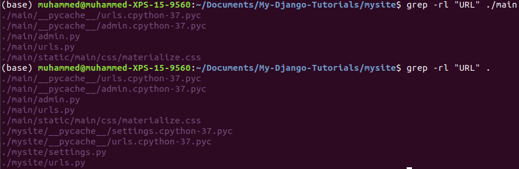
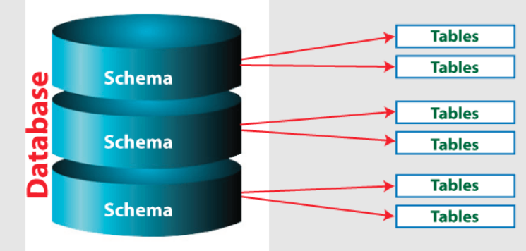
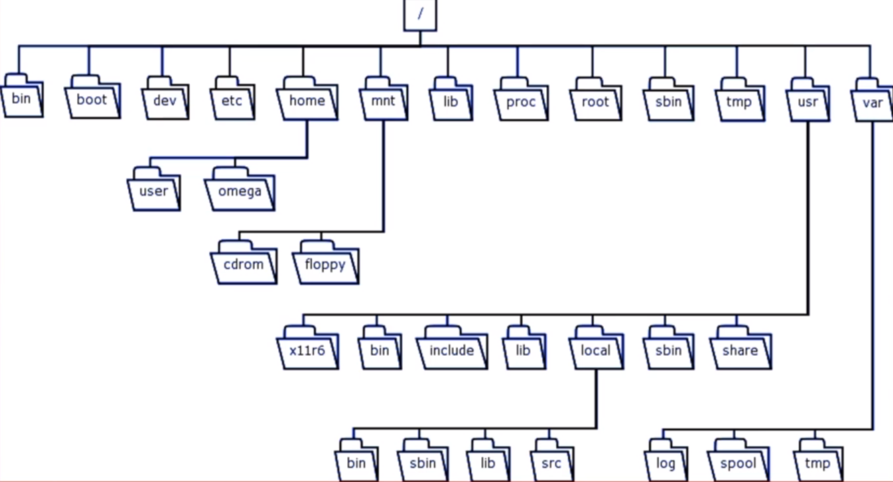

# My-Linux-Commands

This is a repository which summarizes What I learned from [this course (Linux A-Z) on Udemy](https://www.udemy.com/course/linux-egitimi/).

## General Commands

1) Compile and run a cpp file
```
make first_c++.cpp

./first_c++
```

2) Open up a file in a browser

```
google-chrome filename.extension
```

3) To follow CPU

```
sudo apt install sysstat

mpstat -P ALL 1
```

4) Which user is using the machine

```
whoami
```

5) Add a directory to PATH

```
export PATH=$PATH:/usr/projects/mywebsite
```

6) Number of files & directories in a folder

```
ls -altr | wc -l
```

7) Unzip all files in a folder

```
unzip "*.zip"
```


8) Where a file in the system

```
locate elephant.jpg
```

9) To pass to root

```
sudo su -
```

10) To run a script in the background and get back to the terminal, add & to the command

```
./test.sh &
```

11) && is used between 2 commands. Second command runs if first command runs without error. If first command runs with error, second command doesn't run.

```
# If abc.txt is in the folder, second command runs
cat abc.txt && echo "abc.txt file found"

# If def.txt isn't in the folder, second command doesn't run.
cat def.txt && echo "abc.txt file not found"
```

12) || is the opposite of &&.  Second command runs if first command gives an error. If first command doesn't give an error, second command doesn't run.

```
# If abc.txt is in the folder, second command doesn't run
cat abc.txt && echo "abc.txt file found"

# If def.txt isn't in the folder, second command runs.
cat def.txt && echo "abc.txt file not found"
```

13)To list EV's in Linux, run ```env``` command. To see the value of an EV we want to see, run ```echo $NAME_OF_EV``` like ```echo $PATH ```. To create an EV ```export EV_NAME="EV_VALUE" ``. Environment variables aren't stored in some file, but they exist at the runtime of a process.

```
# to print all EV's
env
# To print a specific EV
echo $NAME_OF_EV
echo $PATH
echo $HOSTNAME

#To create a specific EV
export EV_NAME="EV_VALUE"

```

14) Find and replace operation is carried out with sed command

```
sed 's/unix/linux/g' geekfile.txt
```

15) To find a string in all subfolders of a directory(requires permission for the user)

```shell
#Searching URL in all files under main
grep -rl "URL" ./main
# show line numbers of venv in .gitignore file
grep -n venv .gitignore
```

16) To check the status of NVME SSD

```
sudo apt install nvme-cli
sudo nvme smart-log /dev/nvme0
```

17) To convert an image 90 degree in clockwise(convert must be installed before)

```
convert infile.png -rotate 90 /out/directory/is/here/outfile.png ;
```

18) To scan all paths in the computer and put them in a folder named temp; install clamscan and run the following on Terminal

```
sudo clamscan -r --move=/home/muhammed/Desktop/temp /
```



19) scp (secure copy) is a command to transfer files from remote to local or vice versa.

```scp_usage.sh
scp -r -i private_key local_file_path remote_user@REMOTE_IP:/path/on/remote
```

20) To change editor to Nano or Vim

```
export EDITOR=/usr/bin/vim.tiny
```

21) Some shortcuts for terminal. Add it to **~/.bashrc** or **~/.zshrc** . After appending these commands, run `source ~/.bashrc` or `source ~/.zshrc` according to your shell types.

```run.sh
alias svba='source venv/bin/activate'
alias jl='jupyter lab'
alias cdp='cd ~/Documents'
alias gcb='git checkout -b'
alias gcm='git checkout master'
alias gbv='git branch -v'
alias gbd='git branch -d'
alias gpl='git pull origin master'
alias gps='git push'
alias hist='cat ~/.bash_history | grep'
alias svbajl='source venv/bin/activate; jupyter lab'
alias glo='git log --oneline'
alias gbm='git branch -m'
alias gsa='git status'
alias gss='git status -s'
alias grv='git remote -v'
alias ll='ls -altr'
alias linuxr='cd ~/Documents/My-Linux-Commands'
alias dockerr='cd ~/Documents/My-Docker-Notes'
alias djangor='cd ~/Documents/My-Django-Tutorials'
alias gitr='cd ~/Documents/My-Git-Notes'
alias helperr='cd ~/Documents/My-Helper-Functions'
alias generalr='cd ~/Documents/General-IT-Notes'
alias airflowr='cd ~/Documents/My-AirFlow-Notes'
alias mlopsr='cd ~/Documents/My-MLOps-Notes'
alias ..='cd ../'
alias ....='cd ../../'
alias ......='cd ../../../'
```

## Crontab

1) To list cron jobs

```
crontab -l
```

2) To create a cron job

```
crontab -e
```

3) Cronjob configuration is below

```
# ┌───────────── minute (0 - 59)
# │ ┌───────────── hour (0 - 23)
# │ │ ┌───────────── day of month (1 - 31)
# │ │ │ ┌───────────── month (1 - 12)
# │ │ │ │ ┌───────────── day of week (0 - 6) (Sunday to Saturday;
# │ │ │ │ │                                       7 is also Sunday on some systems)
# │ │ │ │ │
# │ │ │ │ │
# * * * * *  command_to_execute
```

4) To run a job in 30th minute of every hour

```
30 * * * * echo 'Hello' >> temp.txt
```

5) To run a job on 1st and 15th day of month

```
0 0 1,15 * * echo 'Hello' >> temp.txt
```

6) To run a command on 10 and its relevant folds minutes(10-20-30-40-50)

```
*/10 * * * * echo 'Hello' >> temp.txt
```

7) To run a command between every hour of 0 and 5

```
0 0-5 * * * echo 'Hello' >> temp.txt
```

8) To edit another user's cron jobs

```
crontab -u user2 -e
```

9) To list and edit root user's cron jobs

```runall.sh
sudo crontab -l
sudo crontab -e
```

10) To remove cron jobs 

```
crontab -r
```

11) [crontab.guru](https://crontab.guru/) is a website to translate time to cron expressions.


## Python Environments - Virtualenv

1) Python environments are used to isolate installed packages from each other. We should always use it(venv or virtualenv). If we don't use it, it will install python packages on our GLOBAL scope & pollute our os environment. Any unexpected bug will lead OS to crash.

2) To install virtualenv, create an example virtualenv, activate a virtualenv, install libraries from a requirements.txt file; run the following

 ```
# to install virtualenv
sudo pip3 install virtualenv

# create an example virtualenv
virtualenv ENV_NAME

# activate a virtualenv
source ENV_NAME/bin/activate

# install libraries from a requirements.txt file
pip install -r requirements.txt

# install a new library except libraries in requirements.txt
pip install NEW_PACKAGE_TO_INSTALL

# To put all installed packages in a requirements.txt file
pip freeze > requirements.txt

# To deactivate an activated environment
deactivate

 ```

 ## venv

 1) venv is Python3's recommended environment manager.

 2) Some widely used command

 ```runall.sh
#To install a venv environment
python3 -m venv ENV_NAME_TO_USE
python3 -m venv ./ENV_NAME_TO_USE/
python3 -m venv venv

# install libraries from a requirements.txt file
pip install -r requirements.txt

#To activate the created environment
source ENV_NAME_TO_USE/bin/activate

#To put all installed packages in a requirements.txt file
pip freeze > requirements.txt

#To put packages only in environment(excluding global packages)
pip freeze --local > requirements.txt

# To install an environment from packages of global python environment
python3 -m venv venv --system-site-packages
```

3) In an envronment, VIRTUAL_ENV environment variable is set to the directory of virtual environment.

```a.sh
source venv/bin/activate
echo $VIRTUAL_ENV
#/home/muhammed/Documents/My-Helper-Functions/venv
```

4) venv doesn't ship with Python version. If we created a virtual environment via venv on Python 3.8, we can't use the same venv on Python 3.10. virtualenv is the opposite. We can specify python version on virtualenv.

5) venv is available as of Python 3.3 and not supporting python 2. However, Virtualenv supports python2.

 ## Conda

1) Conda effectively combines the functionality of pip and virtualenv in a single package (from SOF). Conda is a python manager and an environment manager.

* install package with conda install flake8
* create an environment with any version of Python with conda create -n myenv python=3.6

2) Miniconda installer = Python + conda. Use convenient [miniconda](https://repo.anaconda.com/miniconda/) if you have some kind of experience in Python.

3) Anaconda installer = Python + conda + meta package anaconda. Use anaconda if you are new to Python.

4) Some widely used commands are here

```

# To create a virtual environment named ENV_NAME with python 3.5
conda create --name ENV_NAME python=3.7

# To remove a virtual environment
conda remove --name ENV_NAME --all

# To list all virtual environments
conda info -e

# To activate a virtual environment
conda activate ENV_NAME

# To deactivate a virtual environment (when the virtual environment is active)
conda deactivate

# To list all installed packages in current virtual environment:
conda list

# To install a package in a virtual environment
conda install flask

# To remove a package from a virtual environment
conda remove flask

# To export all installed packages into a yaml file without a prefix section in yaml file (when the virtual environment is active) 
conda env export | grep -v "^prefix: " > environment.yml

# To create a new virtual environment from a yaml file(its name and python version is in environment.yml file)
conda env create -f environment.yml

```

## SSH

1) SSH is a protocol which enables us to connect to a remote machine from our local machine via a text-based interface. To establish a SSH connection, 2 components are needed: a client and the server-side component.(Summary from [here](https://phoenixnap.com/kb/ssh-to-connect-to-remote-server-linux-or-windows))

2) SSH Client is a software we install on our compuyer which enables aus to connect to a remote machine. PuTTY is an SSH client. For many linux distros, an SSH clients comes with themselves by default. If an *SSH client* isn't installed on the system, install it via:

```shell
sudo apt-get install openssh-client
```

3) On server side, a component named as SSH Daemon is required. When the client tries to connect to a remote machine, SSH daemon will respond it. You can install *OpenSSH server* so as to accept SSH connections on the remote machine.

```shell
sudo apt-get install openssh-server ii.
```

4) To check SSH status on server side

```shell
sudo service ssh status
```

5) To take a look at ssh settings in client-side

```shell
cat /etc/ssh/ssh_config
```

6) SSH uses TCP port 22 by defualt. To update ssh configurations on server side(*d* letter of *sshd_config* refers to daemon probably)

```shell
sudo vi /etc/ssh/sshd_config
```

7) To connect a remote server from a loca computer via SSH:

```shell
ssh your_username@host_ip_address
ssh root@165.22.24.206
```


## Public & Private IP

1) In short, your router creates a small network between the computers in your home, while your modem connects that network and thus the computers on it to the internet. The router offers some protection to your devices over being exposed directly to the Internet.  To the Internet, all the traffic coming from your house looks like it’s coming from a single device. Modem is the device that you plugged router into.

2) Since the modem communicates with your Internet service provider, you’ll need the correct type of modem that will work with your ISP’s infrastructure.

3) Some ISPs offer a modem and router in a single device. That device has the electronics and software in it to provide both functions, acting as a modem that communicates with your ISP and functioning as a router to create a home network.

4) In a typical home network, a router has a public IP address on the Internet. The computers, smartphones, game consoles, and other devices behind the router each have a unique private IP address on the home network.

5)  The router acts as an intermediary, forwarding traffic to the local IP addresses that request it. From an outside perspective, all devices on the home network are communicating with the Internet from a single public IP address.


( from [howtogeek](https://www.howtogeek.com/234233/whats-the-difference-between-a-modem-and-a-router/) )


## PostgreSQL

1) To move *postgres* user on Terminal

```
sudo su - postgres
```

2) *postgres* is a database superuser. After moving to postgres user via the command above, run psql command on the Terminal to run SQL queries. Then, run ```SELECT VERSION();``` to learn which PostgreSQL version is installed.

```
psql
```

3) PostgreSQL components are:
    - PostgreSQL Server; to install the PostgreSQL database server 
    - pgAdmin4 ; to install the PostgreSQL database GUI management tool
    - Command Line Tools such as psql, pg_restore; to interact via a CLI
    - Stack Builder; to install drivers

4) pgAdmin4 & psql can be thought as a client and PostgreSQL Server can be thought as a server.

5) Database server is a computer software, which is used to backup the program and data of other computers or just computer programs. It is also known as client server model.

6) PostgreSQL enables us to grant permissions to users but this isn't recommended.

7) In oracle, User = Role + Login Permission

8) In PostgreSQL, users = groups = roles

9) To create a PostgreSQL user

```psql
CREATE USER myuser IWTH PASSWORD 'PAROLA';
```

10) New Permissions inherift permisssions from the public role.

11) When a DB is created, a schema named public is created too. Also, a role named public is created.

12) When a users created a table without specifying the schema name, it was created under public

13) To create a database on psql

```
CREATE DATABASE DATABASE_NAME
```

14) To create a schema

```
CREATE SCHEMA MYSCHEMA
```

15) To create a role

```
CREATE ROLE ROLE_NAME
```

16) Postgres is set up to use ident authentication, meaning that it associates Postgres roles with a matching Unix/Linux system account. If a role exists within Postgres, a Unix/Linux username with the same name is able to sign in as that role

[from digital ocean](https://www.digitalocean.com/community/tutorials/how-to-install-and-use-postgresql-on-ubuntu-20-04)



17) Postgresql user is ready to connect to a database whose name is the same as postgresql user name. Some commonly used psql commands are below 

```
# To see connection info
\conninfo
# To quit psql
\q
# To list databases
\l
# To list tables and their serials of a connected database
\d
# To list only tables of a connected database
\dt
# To list only serials of a connected database
\ds
# To list all postgresql users with extra info
\du+
# To list all postgresql users without extra info
\du
# To connect a database
\c DATABASE_NAME_TO_CONNECT


```


# Make a bootable Windows USB in Ubuntu

1) Download iso file from Microsoft's official web page.

2) Open up Disks

3) Format USB to MBR or GPT (doesn't matter) via clicking 3 dots.

4) Format partition of USB to FAT32

5) Run the following linux command. Change it to proper names if needed. **/dev/sda1** is the directory of where USB is located. **/home/muhammed/Downloads/Win10_21H1_Turkish_x64.iso** is where iso file located.

```
sudo dd bs=4M if=/home/muhammed/Downloads/Win10_21H1_Turkish_x64.iso of=/dev/sda1 conv=fdatasync  status=progress
```

6) To safely remove the USB, open up Disks and unmount the partition/disk.

## Virtualization

1) Download virtualbox to install a virtual ubuntu environment.

2) We can take snapshots of virtual environment. Then, we can import these snapshots into VirtualBox.

3) We can watch the statistics of Linux distributions on [this link](https://distrowatch.com/table.php?distribution=ubuntu)

4) After installation, we can upgrade the RAM of virtual machine.

5) After installing virtual box, extension pack of virtualbox should be installed.

6) Virtual Box > Devices > Insert Guest Edition CD Image. We can copy from our desktop to virtual box.

## Intro to Linux

1) User Interface > Shell > Kernel

2) Linux is a kernel; not an OS.

3) Kernel deals with RAM, CPU, Operations. It decied which program uses RAM, disc etc. 

4) Shell is a layer in which user communicate with OS.

5) For OS to be run, Kernel and Shell are enough. User Interface isn't basically required.

6) MacOS is also designed as User Interface > Shell > Kernel.

7) Terminal is an interface to run commands on shell.

8) To print a string on terminal:

```
echo string_name_printed
```

9) There isn'y only one shell; many shells exist.

10) To see which shell we have
```
echo $SHELL
```
11) To learn which shell version we have

```
echo $BASH_VERSION
```

12) Basic commans: ls, cd, echo, pwd, cat, >, >>

13) To print 2 files one under the other on Terminal.

```
cat file1 file2
```

14) To get help for a command: example cat. man represents manuel

```
man cat
```

15) To enumerate all lines of a file

```
cat -n vim_commands.txt 
```

16) To delete all things in a file and add a new line to a file

```
echo new_line > file_name.txt
```

17) To add a new line to an existent file
```
echo new_line >> file_name.txt
```

18) To find lines of a pattern in a file
```
cat file_name | grep search_pattern
```

19) To list all files in a folder
```
ls path_of_folder
```

## File & Folder Operations

1) You can check out 



2) /etc is a directory having configuration files.

3) /proc is a direcotry dealing with processes.

4) /bin means binary and it also means executable files.

5) /sbin means system binary.

6) /opt means optional and third party softwares were installed here.

7) /media is related to mounting hard disc and USB.

8) Everything in Linux has a pattern of folder and file.

9) To create a file in Linux

```
touch file_name
```

10) $ sign on Terminal means Home directory

11) To delete a folder
```
mkdir folder_name

rmdir folder_name
```

12) To list numeric user and group ID

```
ls -n
```

13) To rename a file

```
mv file_old_name file_new_name

rename file_old_name file_new_name
```

14) To move a file or a folder respectively

```
mv filename /home/muhammed/

mv my_resume/ ./URBANSTAT/
```

15) To copy a file or a folder respectively

```
cp filename /home/muhammed/

cp -r my_resume/ ./URBANSTAT/
```

16) To find a file in OS, use **find** and **locate** commands. locate is like searching on DB, find is like searching all things one by one.
To effectively use locate, update DB regularly.
```
sudo updatedb
```

17) find is more powerful, locate is more useful.

18) To search a particular file on a specific path and its roots

```
find search_path -name filename.txt
```

19) To search a text pattern on a path

```
find search_path | grep searched_pattern
```

20) To find a file with locate

```
locate file_name
```

21) To zip a file or folder using tar. c:create, v: verbose, f: file name of new tarred file.

```
tar -cvf zipped_file_name.tar zipped_file.txt

tar -cvf zipped_file_name.tar zipped_folder/
```

22) To unzip a folder

```
tar -xvf tarred_file.tar

tar -xvf tarred_file.tar -C path_of_new_unzipping_folder_that_was_created_before

tar -xvf tarred_file.tar --one-top-level=serhat

tar -xvf tarred_file.tar --one-top-level=/home/serhat/Desktop/serhat
```

23) To glance a file in Terminal. more: to look line by line, head: first 8 lines, tail: last 8 lines, cat: to see all lines, tac: to see all lines in reverse order

```t.sh
more file_name

head file_name

tail file_name

cat file_name

tac file_name

# To see last 5 lines of all fils starting with logg and enting with .py.
# 5 can be modified to 10 or 999 or another values
tail -n5 logg*.py
```

24) Driver and bootloader issues may cause UI not to work.

25) ^ in nano means CTRL. CTRL+o to save changes into a file; CTRL+x to exit

26) We can run shell commands on vi. This characteristic was used by CyberSecurity guys.

## User Operations

1) Linux has a multi-user OS, which means that 2 people can use the same computer simultaneously. This is mostly valid for server operations.
While I was working at Turkcell, We were logging in the same machine simultaneously.

2) To see which users are logged in right now:

```
users
```

3) There are more users in Linux than we assume. Users can be grouped into 2 groups: 1- System users 2- Logged-in users

4) Root user has 0 id number. System users' id range from 1 to 999. Logged-in users' id's start from 1000. Each user has an id. To see detailed id information of a user

```
id
```

5) Root has a right to do everything. It is impossible to remove the rights of root.

6) To see id of a specific user
```
id -u muhammed
```

uid=1000(muhammed) gid=1000(muhammed) groups=1000(muhammed),4(adm),24(cdrom),27(sudo),30(dip),46(plugdev),116(lpadmin),126(sambashare)

uid -> userid
gid -> an id which was created when user was created.
groups -> the roles which a user has

7) To list all log in users and system users on Terminal

```
cat /etc/passwd
```

8) Meanings of user components

muhammed : x : 1000:1000:muhammed,,,:/home/muhammed:/bin/bash

muhammed -> Username

1000 -> User id

1000 -> Group id

muhammed -> Name

/home/muhammed -> Home directory

/bin/bash -> Directory of shell. If not depicted, user can't use shell.

9) To know which logged-in users are logged in now

```
cat /etc/passwd | grep bash
```

10) To see which groups am I in?

```
groups
```

11) To see which groups exist in the system
```
cat /etc/group
```

12) To list users' passwords

```
sudo cat /etc/shadow
```

```
mark:$6$.n.:17736:0:99999:7:::
[--] [----] [---] - [---] ----
|      |      |   |   |   |||+-----------> 9. Unused
|      |      |   |   |   ||+------------> 8. Expiration date
|      |      |   |   |   |+-------------> 7. Inactivity period
|      |      |   |   |   +--------------> 6. Warning period
|      |      |   |   +------------------> 5. Maximum password age
|      |      |   +----------------------> 4. Minimum password age
|      |      +--------------------------> 3. Last password change
|      +---------------------------------> 2. Encrypted Password
+----------------------------------------> 1. Username
```

13)To list the groups and which users have those groups on Terminal. System groups range from 0 to 1000. User groups range from 0 to 1000.

```
sudo cat /etc/group
```

14) Ownership: User, Group, Other

    User: Owner of a file

    Group: Multiple users in the same group. They have the same rights. A user can be in many groups. A file can be owned only one group.

    Other: Any other user having access to the file.

15) Permissions: Read, Write, Execute

    Read: Authenticity to read a file and take a look

    Write: Add & remove & rename authenticity

    Execute: Ability to run a file.

16) Sudo is actually a program. To check this, run ``` sudo --version ``` to see an output below.


**Sudo version 1.8.21p2**
**Sudoers policy plugin version 1.8.21p2**
**Sudoers file grammar version 46**
**Sudoers I/O plugin version 1.8.21p2**

17) We pretend to log in as root thanks to **sudo** command. **sudo** is like run as administrator in windows.

18) sudoers is a file under /etc/sudoers directory. Configurations are in this file.

19) To create or update a password for an existent user

```
passwd user_name_we_use

# For root
sudo passwd root
```

20) It is prohibited for root user to log in from UI by default. There are many ways to change this.

21) To be root in Terminal, write the command below and enter your user password

```
sudo su
```

22)To change user on current session in Terminal

```
su muhammed2
```

23) Permission is the right to do sth or not to do sth. Permissions can be thought on top of file permissions, user permissions, group permissions. Permissions of a file can be seen with ls -al. For instance

**-rw-r--r--  1 muhammed muhammed      98 Eyl 25 21:21  temp.txt**


-rw-r--r-- has 10 characters that have these meanings:

1      -->     -          --> File(-) or directory (d)

2-3-4  -->     rw-        --> Permissions of user

5-6-7  -->     r--        --> Permissions of group

8-9-10 -->     r--        --> Permissions of other


24) To change file permisssions for user or group or other, use chmod

```
chmod u=rwx,g=rwx,o=rwx file_name

chmod u=r,g=w,o=x file_name

#To enable root only
chmod u=,g=,o= file_name
```

25) The permissions and their corresponding numbers in the base of 8. 0 means no permission.

read --> 4

write --> 2

execute --> 1

777 means (4 + 2 + 1 )(4 + 2 + 1 )(4 + 2 + 1 ) in reality.

```
chmod 777 file_name
chmod 644 file_name
chmod 755 file_name

# remove read permission from user
chmod -400 file_name
# remove execute permission from group
chmod -010 file_name
# remove write permission from other
chmod -002 file_name
# add read permission to user
chmod +400 file_name
# add execute permission to group
chmod +010 file_name
# add write permission to other
chmod +002 file_name
```

26) useradd is in all linux distros. adduser is in some of them. Ubuntu has useradd and adduser. adduser is more used and suggested. adduser is more useful in system management because it requires more info for users. When a user was created, a group user who has the same name was also created by default. To create a user to OS,

```
sudo adduser user_name_to_add
```

27) To create a group to OS,

```
sudo groupadd group_name_to_add
```

28) To change user and group user of a file

```
sudo chown new_user_name:new_group_name file_name
```

29) A user may have many groups but a file belongs to only one group. If a user has a particular group and that particular group is group user of a file, that user may edit that file even if that user isn't the user owner of that file. To add a group to a user.

```
sudo usermod -a -G group_name_to_add user_name_to_get_group
#This operation may require rebooting
```

30) To remove a group from a user

```
sudo deluser user_name group_name_to_remove
```

31) When a user was removed from OS, the files it has will have no user. Root should come and interfere in this situation. To remove a user from OS,

```
sudo userdel user_name_to_remove
```

32) When a group was removed from OS, the files it has will have no group. Root should come and interfere in this situation.  To remove a group from OS,

```
sudo groupdel group_name_to_remove
```

## Process Operations

1) Opening a program, opening a picture etc; all of them have a process id. All processes have a unique id. It is like task manager in Windows. System monitor in Linux is similar to Task Manager in Windows.

2) To see processes only logged in users has
```
ps
```

3) To see all process. x means all users, u: means user. It outputs a lot of columns. COMMAND column shows which code were run to make that process work.

```
ps -aux
```

4) When we write a Linux code on terminal, it will become a process too.

5) To kill a process from Terminal,

```
kill -9 process_id_we_want_to_kill
```

6) xkill command used to kill a process that we touch by the mouse.

7) To see processes of root and mine

```
ps -aumuhammed

ps -auroot
```

8) To kill a process with the name of the program of the process

```
killall python3

killall process_program 
```

9) To put a running program into the background, press CTRL + Z.

10) To see programs in the background

```
jobs -l
```

```
bg
```

10) To put back a program into the foreground

```
fg the_id_jobs-l_shows

fg 1
```

11) systemd is a tool to manage services in Linux. "A service is a program that runs in the background outside the interactive control of system users as they lack an interface" (from hostinger.com) . There are many types of services, special to root or special to user etc. gdm, ssh, apache server can be examples.

12) systemctl is coming by default. To see the current situation of a service.

```
sudo service gdm3 status

sudo systemctl status gdm3.service
```

13) To see the content of an example service, run below:

```
vi /lib/systemd/system/gdm.service
```

14) To list all services on Terminal. systemctl manages services, sockets, mounts, target processes.
systemctl is more comprehensive than service.

```
service --status-all

systemctl list-units --type=service
``` 

15) Some important services:

acpid: managing tools which are responsible for shut down, power off etc

alsa-utils: dealing with sound drivers

cron: Linux crontab is similar to Task Schedule of Windows.

gdm: display manager

network-manager: responsible for activating network interface.

16) To restart a service via service or systemctl managed by root, use sudo before service or systemctl commands.

``` 
sudo service service_name restart

sudo service gdm3 restart

sudo systemctl restart gdm3.service
``` 

17) To stop, start and restart a servicenot by run by root

``` 
service network-manager stop

service network-manager start

service network-manager restart
``` 

18) If we want to create a new service from scratch wiyh our user, we should put it under /etc/systemd/user directory. However, system services are under /etc/systemd/system directory.

## Shell Scripting

1) Bash is the most used shel version.

2) If you consider to be a system administrator, this part is essential.

3) How many active users exist, analyzing daily DB usages, usage of scheduled tasks (crontab), network monitoring 

4) A written shell script might be run as a startup service.

5) Some sources to use in shell scripting

- https://reddit.com/r/bash

- https://github.com/awesome-lists/awesome-bash

- https://github.com/alexanderepstein/Bash-Snippets

6) It is possible to run python code snippets in .sh code.

7) An example shell script start with:

```
#! /bin/bash


```

## Package

1) Package can be thought as setup.exe in Windows.

2) A windows package can't in installed on Linux or not.

3) Each Linux distro has different configurations for installations.

4) https://packages.ubuntu.com

5) Ubuntu and Debian have the same package management system 

6) Package extension for different linux distros 

Debian, Ubuntu --> .deb

Centos --> .yum

7) Ubuntu's package manager = dpkg; 

8) apt(advanced package tool manager) is an advanced kind of dpkg to install deb packages. apt is high level, dpkg is low level.

9) The sources apt uses should be kept up-to-date. The sources that apt uses can be listed with:

```
cat /etc/apt/sources.list
```

10) To update apt

```
sudo apt update
```

11) It is recommended to do ``` sudo apt update ``` before installing any kind of software.

12) apt is so clever that it took Ubuntu to a better place in terms of package management.


13) To install a package or many packages with apt in one line.

```
sudo apt install package_name
```

```
sudo apt install package_name1 package_name2 package_name3
```


14) To uninstall (remove) a package with apt from OS

```
sudo apt remove package_name
```

15) To search a package in Ubuntu repos

```
apt search package_name
```

16) dpkg wasn't able to deal with depenencies. Hence, apt appeared out as a solution.

17) To install a package with dpkg

```
dpkg -i package_name.deb
```

18) To liss packages installed

```
dpkg -l
```

19) To remove a package with dpkg

```
dpkg -r package_name_in_the_OS
```

20) build-essential is a package to install packages downloaded from 3rd party software.

21) At the beginning, dependencies should be installed. Then, A 3rd party software mas be configured, Then, ```make``` command should be run. Finally, ```make sudo install``` command should be run. If you want to uninstall it, ```make sudo uninstall``` command should be run.

22) 3rd party softwares should be put in /opt/ folder


## Free Section

1) It would be nice to say GNU/Linux rather than Linux because they were different projects. GNU started as a project in 1980's but it didn't perform well. Then, Linus torvalds integrated Linux kernel with GNU project and the base version of current Linux distros appeared out.

2) Linux appeared as an opposition to intellectual property.

3) Open source doesn't mean free software. Open source means being able to see source code.

4) Gnome 3 and KDE were widely used in Ubuntu Interfaces (Default: gnome 3)

5) Gnome Tweaks is a tool to configure and change gnome 3

6) Libre draw can be used as a drawing tool.

7) Remmina RDP is a remote desktop client to connect to remote windows machines.

8) Window Manager: Pencere yöneticisi, Desktop Environment: Masaüstü ortamı, Display Manager: Görüntü yöneticisi

9) Pantheon is a Desktop Environment similar to OS X.

10) For default Ubuntu, GNOME is Desktop Environment; GDM3 is a window manager.

11) To learn display manager of your desktop environment, run the following:

```
systemctl status gdm3.service
```

12) MATE (GNOME 2) can be installed.

13) Openbox is a window manager. It has no desktop. 

## Others

1) To create a user in linux(must be logged in root)

```
adduser USER_NAME_TO_ADD
```

2)Give that user sudo privileges

```

usermod -aG GROUP_NAME_TO_BE_ADDED USER_NAME_TO_ADD

usermod -aG sudo USER_NAME_TO_ADD
```

3) To follow sh script in DEBUG mode to catch where the error occurs

```
set -x
```

4) To list which ports are listeing on a Unix-like OS

```
sudo netstat -tunlp
```

5) */etc/apt/source.list* is a configuration file for Linux's Advance Packaging Tool, that holds URLs and other information for remote repositories from where software packages and applications are installed -- from [here](https://dev.to/bijaykumarpun/what-s-inside-etc-apt-sources-list-2h1k)

6) To display IP configuration of the machine,

```
ifconfig -a
```

7) `id` is a command to show info about user. The below code shows details about user muhammed and group muhammed.

```id.sh
id muhammed
```

8) ln is a command in Linux to make links between files. Two types are symbolic or hard links. Generally, soft link is used. Soft link (aka symbolic link) is similar to windows shortcuts.

```
# Soft link

# Soft link
ln -s {source-filename} {symbolic-filename}
# Example
ln -s file1 link1
# Directory mapping is also possible.
ln -s /source/directory/here/ /sot(link/directory/here/

```

9) To list Python packages used by OS, run `dpkg -l | grep python3`

10) To get latest word of a unix command in the current terminal, use `!$`. Firstly, run `ls -altr` and secondly run `!$` to get `-altr`. `!!`(Bang bang) is used to grab whole last command. `!!` can be used via `git commit -am "!!"` to pass latest command as git commit message.

11) To remove multiple files in a short way, use curly brackets in rm command.

```run.sh
# remove multiple files, removing file1.py, file2.py, file3.py, file4.py
rm file{1,2,3,4}.py
```
12) Ctrl + R used for reverse search in history. Press more than once to go backward.

13) `fc` is a linux command meaning fix command. If you write some shellscript code wrong and want to fix it, it enables you to run it in default editor(vim, nano, emacs etc). It is useful in long commands with many arguments especially.

14) To see folder structure with a level

```tree.sh
# To see folders and files up to 3 more levels
tree -L 3 folder_name
```

15) In order to delete a file in a safer way, run first `shred file_name` and then remove it via `rm -rf file_name`. `shred` command creates a binary file which is harder to recover.

16) `jq` is a command line JSON processor. It works on Linux Terminal. We can cat a file and use jq to get relevant information from it.

